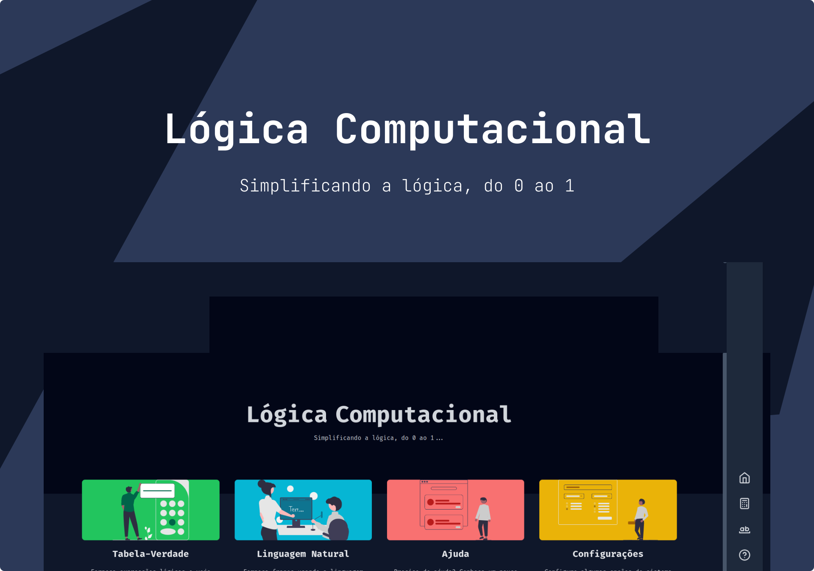

<h1 align="center">
  Computer Logic
</h1>
<p align="center">
  A project of a computational logic calculator based on college studies.
</p>
<p align="center">
  <a href="LICENSE" target="_blank">
    
  </a>
  
  

  

  <a href="https://vercel.com/eriikgabriel/computer-logic" target="_blank">
    
  </a>
</p>



## 🧪 Technologies

This project was developed using the following technologies:

<a href="https://nextjs.org/" target="_blank">
    
</a>
<br>
<a href="https://www.typescriptlang.org/" target="_blank">
    
</a>
<br>
<a href="https://tailwindcss.com/" target="_blank">
    
</a>

## 🛠️ Installation and Setup

1. Clone the repository

   ```sh
   git clone https://github.com/EriikGabriel/computer-logic.git
   ```

2. Access the folder.

   ```sh
   cd computer-logic
   ```

3. Install dependecies:

   ```sh
   npm i
   ```

4. Start the development server:

   ```sh
   npm dev
   ```

   The app will be available for access on your browser at http://localhost:3000

## 🚀 Project Deploy

This project was deployed on the [Vercel](https://vercel.com/) platform and can be accessed [here](https://computer-logic.vercel.app).

## 📝 License

This project is licensed under the MIT License. See the [LICENSE](LICENSE) file for details.

---

_Developed by [Erik Gabriel](https://github.com/EriikGabriel) 🚀_
